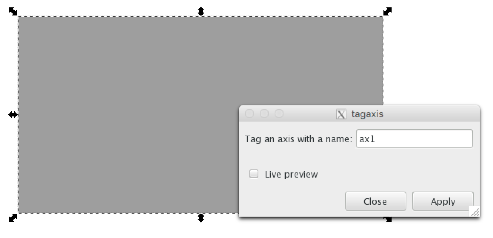

Basic Usage
===========

Overview
--------

With figurefirst creating a new figure generally involves four steps:

1.	Design the layout file. Fundamentally this means decorating a specific subset of the objects in the svg files with xml tags that identify what objects are something figurefirst should expose to Python.
2.	Convert the information in the graphical svg objects into python objects. This is accomplished via the :class:`~figurefirst.svg_to_axes.FigureLayout` class.
3.	Plot data, taking advantage of the objects created within the :class:`~figurefirst.svg_to_axes.FigureLayout` to style and organize the figure.
4.	Merge newly created matplotlib figures with the original layout file and save to svg.

A multipanel figure
---------------------

To get started it is worth examining how the figurefirst approach compares to generating a similar figure using matplotlib alone. Consider a five-panel figure with non-uniform axes sizes such as the example shown in the `matplotlib gridspec documentation <http://matplotlib.org/users/gridspec.html>`_ .

To generate this figure using only matplotlib and gridspec we would use the following code ::
	
	from matplotlib import pyplot as plt
	ax1 = plt.subplot2grid((3, 3), (0, 0), colspan=3)
	ax2 = plt.subplot2grid((3, 3), (1, 0), colspan=2)
	ax3 = plt.subplot2grid((3, 3), (1, 2), rowspan=2)
	ax4 = plt.subplot2grid((3, 3), (2, 0))
	ax5 = plt.subplot2grid((3, 3), (2, 1))

.. image:: https://matplotlib.org/users/plotting/examples/demo_gridspec01.png

Now if we want to plot data to any of these axes, we can direct our plotting commands to the appropriate axes e.g. ax1.plot([1,2,3,4])

To construct a similar plot in figurefirst, we use Inkscape to create a .svg layout document by drawing boxes where the 5 axes should lie, then tag these boxes with names eg. ax1,ax2 ect... Then to make the figure in python we construct a :class:`figurefirst.svg_to_axes.FigureLayout` object by passing the path to the layout document. ::

	import figurefirst as fifi
	layout = fifi.FigureLayout('/path/to/layout.svg')

Figurefirst will construct the matplotlib figure and store the axes by their tag name in the 'axes' attribute of the layout object. So to plot on ax1 ::

	layout.axes['ax1'].plot([1,2,3,4])

Designing a layout
-------------------

So how do you design a layout? The easiest approach is to use inkscape and take advantage of the figurefirst extensions to tag the axes with unique names. We create a new document specifying the height and width of the figure in the document properties menu. Next we use the rectangle tool to draw boxes where we want our axis to appear within the figure. Finally, we give these axes names using the tagaxis extension. The screenshot below shows the tagaxis dialog box being used to tag a box with the name 'ax1'.

Merging matplotlib plots back into the layout
----------------------------------------------

Simply being able to svg as a specification for axis placement is a useful feature on it's own, but figurefirst allows you to take things one step further and direct the output of your plotting code back into the svg layout document. This means that any svg vector art that you include in your layout document can now be used as overlays and underlays to your matplotlib figures. To save our new plots we simply call ::

	layout.save('/path/to/output_file.svg')

By default figurefirst will create a new svg layer to place all the new matplotlib artwork. Note that merging your newly plotted figures with the layout in this way also provides a mechanism for fast iterative development of your figures: you save the plotted data back in the layout document (passing the original layout file as output_file) then you can now make adjustments to the layout, add annotations ect. to the layout with the perspective of how the data lie within the figure. After making these changes we can re-run our plotting code at any time to regenerate the plots without worrying about loosing these annotations.

