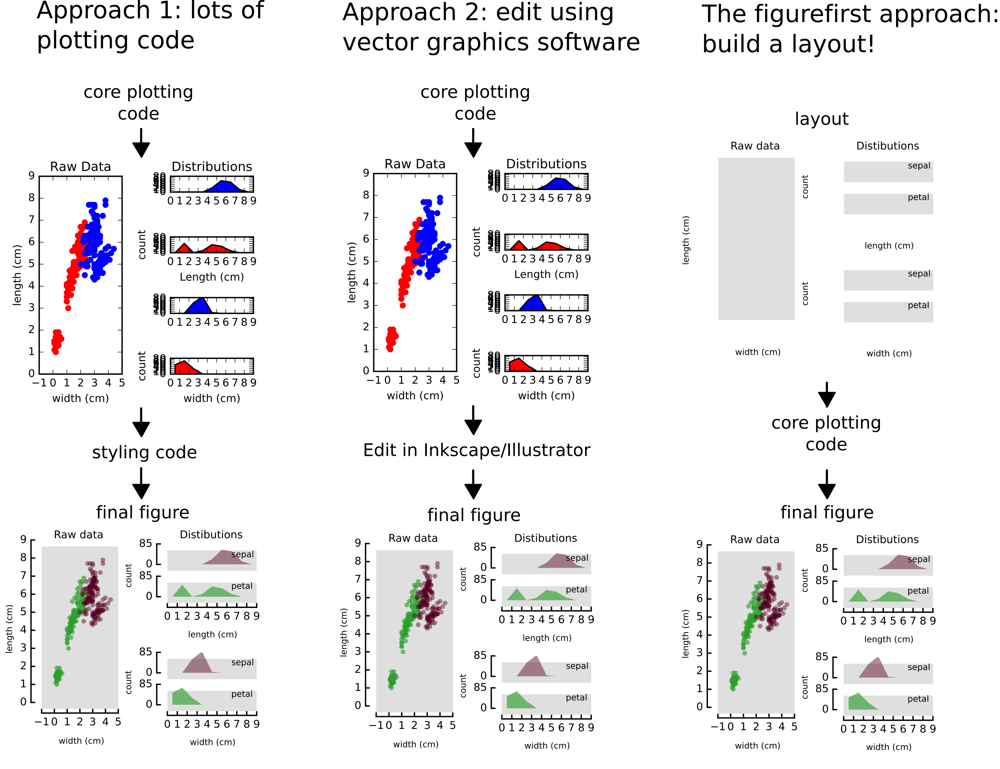

Introduction
===========

What is figurefirst?
--------------------
Constructing figures for publication in scientific journals requires some attention to the details of styling and layout. For example, consider the descriptive analysis of the iris dataset below. The plot on the right was constructed using the matplotlib gridspec tool, and is perfectly acceptible representation of the data; but a more efficent use of the space can be achieved with a little manual tweaking. Note how the x axis is shared accross distribuation and how the layout helps indicate the structure of the data. The main objective of figurefirst is to facilitate the construction of these more organic layouts with minimal work.

What problem does figurefirst solve?
------------------------------------
Traditonaly there are two basic approaches for solving the flexible layout problem.
	(1) after deciding on the basic scheme, you can take customize your plotting code to acheive the prescise layout you want. This approach is often very time consuming because graphical decisions are difficult to evaluate using a strictly text-oriented approach. Additionaly, this approach often leads to plotting functions where most of the code is devoted to styling and core plotting code -- the 'what' and 'how' of the functions -- are hard to parse.

	(2) Construct a basic, plot and then manually adjust the plots using a vector graphics tool such as Inkscape or Adobe Illustrator. This approch breaks down if new data need to be ploted or the plotting function changes (for instance, in response to reviewers).

Figure first adds a third option: Use a layout document to specify all the stylistic descisons, and target your plotting functions to this layout as you see fit.



How does figurefirst work?
--------------------------
The ```figurefirst``` library seeks allow effort devoted to the raw analysis and raw presentation of data to proceed *in parallel* and *independent to* the work styling and formating the figure. The approach we take is to facilitate passing graphical information from the `open-standard <https://www.w3.org/TR/SVG/>`_ scalable vector graphics (svg) file format into objects consumable by the open-source `matplotlib <http://matplotlib.org>`_ python plotting library. This allows authors to take advantage of sophisticated SVG editors such as inkscape to start constructing final-form figures early in the process of manuscript preparation, while retaining the freedom to collect new data and revise analysis.

Should I use figurefirst?
-----------------------------
The traditional work-flow may be suitable in many cases, but it is inherently a uni-directional process: an experiment is designed, data are collected, analyzed, a manuscript is written, and the analysed data are assembled into a final figure sequence. Science rarely advances in such a linear manner: new data are collected, analyses are revised and even new experiments are conceived well after the writing process has commenced. Several authors, for example `George whitesides <https://www.youtube.com/watch?v=q3mrRH2aS98>`_, have proposed initiating the process of manuscript assembly at the most preliminary findings by constructing an outline. and itteratively building the manuscript as you perform experiments by filling out this outline. The Figurefirst philosophy is analogous, with the layout serving much like the outline, allowing figure to be filled out as hypothesis are tested and experiments are performed.