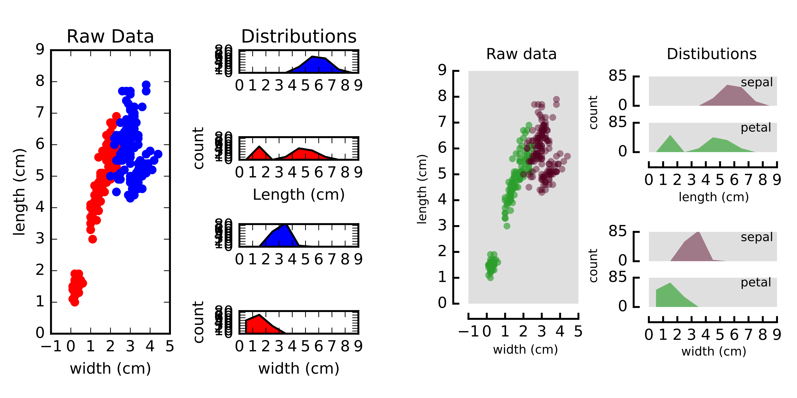

Introduction
============

What is figurefirst?
--------------------
Constructing figures for publication in scientific journals requires some attention to the details of styling and layout. For example, consider the descriptive analysis of the iris dataset below. The plot on the left was constructed using the matplotlib gridspec tool, and is a perfectly acceptable representation of the data; but a more efficient use of the space can be achieved with a little manual adjustment. Note how in the version on the right, the x axis is shared across distributions, and the layout helps clarify the structure of the data. The main objective of figurefirst is to facilitate the construction of these more organic layouts with minimal work.

What problem does figurefirst solve?
------------------------------------
Traditionally, there are two basic approaches for solving the flexible-layout problem.
	(1) After deciding on the basic scheme, you can customize your plotting code to achieve the precise layout you want. This approach is often very time consuming because graphical decisions are difficult to evaluate using a strictly text-oriented approach. Additionally, this approach often leads to plotting functions where most of the code is devoted to styling. This makes the core plotting logic hard to parse.

	(2) Construct a basic plot and then manually adjust the plots using a vector graphics tool such as Inkscape or Adobe Illustrator. This breaks down if new data need to be plotted, or the plotting function changes. For instance, after recieving reviews you may need to add a control group to your figure. You would need to re-apply all the manual adjustments in Illustator at this point.

figurefirst adds a third option: Use a layout document to specify all the stylistic decisions, and target your plotting functions to this layout as you see fit.

.. image:: images/intro_var_approaches.png

How does figurefirst work?
--------------------------
The ``figurefirst`` library seeks to allow effort devoted to the raw analysis and raw presentation of data to proceed *in parallel* and *independent to* the work of styling and formating the figure. The approach we take is to facilitate passing graphical information from the `open-standard <https://www.w3.org/TR/SVG/>`_ scalable vector graphics (svg) file format into objects consumable by the open-source `matplotlib <http://matplotlib.org>`_ Python plotting library. This allows authors to take advantage of sophisticated SVG editors such as Inkscape to start constructing final-form figures early in the process of manuscript preparation, while retaining the freedom to collect new data and revise analyses.

Should I use figurefirst?
-----------------------------
The traditional work-flow may be suitable in many cases, but it is inherently a uni-directional process: an experiment is designed, data are collected and analyzed, a manuscript is written, and the analyzed data are assembled into a final figure sequence. Science rarely advances in such a linear manner: new data are collected, analyses are revised, and new experiments are conceived even well after the writing process has commenced. `Some authors <https://www.youtube.com/watch?v=q3mrRH2aS98>`_ have proposed initiating the process of manuscript assembly at the most preliminary findings by constructing an outline and iteratively building the manuscript as experiments are performed by filling out this outline. The figurefirst philosophy is analogous, with the layout serving much like the outline, allowing the figure to be filled out as hypotheses are tested and experiments are performed.
